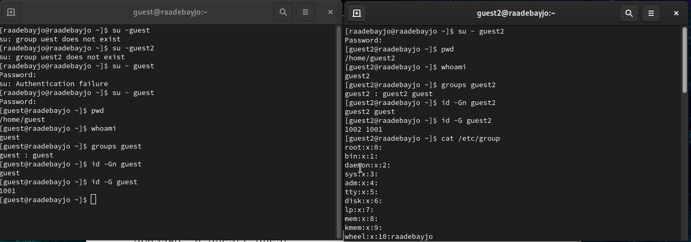

---
## Front matter
title: "Отчёта по лабораторной работе № 3"
subtitle: "Информационная безопасность"
author: "Адебайо Ридвануллахи Айофе"

## Generic otions
lang: ru-RU
toc-title: "Содержание"

## Bibliography
bibliography: bib/cite.bib
csl: pandoc/csl/gost-r-7-0-5-2008-numeric.csl

## Pdf output format
toc: true # Table of contents
toc-depth: 2
lof: true # List of figures
lot: true # List of tables
fontsize: 12pt
linestretch: 1.5
papersize: a4
documentclass: scrreprt
## I18n polyglossia
polyglossia-lang:
  name: russian
  options:
	- spelling=modern
	- babelshorthands=true
polyglossia-otherlangs:
  name: english
## I18n babel
babel-lang: russian
babel-otherlangs: english
## Fonts
mainfont: PT Serif
romanfont: PT Serif
sansfont: PT Sans
monofont: PT Mono
mainfontoptions: Ligatures=TeX
romanfontoptions: Ligatures=TeX
sansfontoptions: Ligatures=TeX,Scale=MatchLowercase
monofontoptions: Scale=MatchLowercase,Scale=0.9
## Biblatex
biblatex: true
biblio-style: "gost-numeric"
biblatexoptions:
  - parentracker=true
  - backend=biber
  - hyperref=auto
  - language=auto
  - autolang=other*
  - citestyle=gost-numeric
## Pandoc-crossref LaTeX customization
figureTitle: "Рис."
tableTitle: "Таблица"
listingTitle: "Листинг"
lofTitle: "Список иллюстраций"
lotTitle: "Список таблиц"
lolTitle: "Листинги"
## Misc options
indent: true
header-includes:
  - \usepackage{indentfirst}
  - \usepackage{float} # keep figures where there are in the text
  - \floatplacement{figure}{H} # keep figures where there are in the text
---

# Цель работы

Получение практических навыков работы в консоли с атрибутами файлов для группы пользователей.

# Tеорическое введение

В операционной системе Linux есть много отличных функций безопасности, но одна из самых важных - это система прав доступа к файлам. Изначально каждый файл имел три параметра доступа. Вот они:

* Чтение - разрешает получать содержимое файла, но на запись нет. Для каталога позволяет получить список файлов и каталогов, расположенных в нем

* Запись - разрешает записывать новые данные в файл или изменять существующие, а также позволяет создавать и изменять файлы и каталоги

* Выполнение - невозможно выполнить программу, если у нее нет флага выполнения. Этот атрибут устанавливается для всех программ и скриптов, именно с помощью него система может понять, что этот файл нужно
запускать как программу

Команды, которые могут понадобиться при работе с правами доступа:

* “ls -l” - для просмотра прав доступа к файлам и каталогам

* “chmod категория действие флаг файл или каталог” - для изменения прав
доступа к файлам и каталогам (категорию действие и флаг можно заменить
на набор из трех цифр от 0 до 7)

Значения флагов прав:

* – - нет никаких прав
* –x - разрешено только выполнение файла, как программы, но не изменение и не чтение
* -w- - разрешена только запись и изменение файла
* -wx - разрешено изменение и выполнение, но в случае с каталогом, невозможно посмотреть его содержимое
* r– - права только на чтение
* r-x - только чтение и выполнение, без права на запись
* rw- - права на чтение и запись, но без выполнения
* rwx - все права

# Выполнение лабораторной работы

В установленной при выполнении предыдущей лабораторной работы ОС, я создал учётную запись пользователя **guest2** (т.к. пользователь guest уже был создан в прошлой лабораторной работе) с помощью команды `useradd guest2` и задал пароль для этого пользователя командой `passwd guest2`. Добавил пользователя guest2 в группу guest с помощью команды  `gpasswd -a guest2 guest` (рис. @fig:001)

{#fig:001 width=70%}

Затем осуществил вход в систему от двух пользователей на двух разных консолях при помощи команд `su - guest` и `su - guest2`. Определил командой `pwd`, что оба пользователя находятся в своих домашних директориях, что совпадает с приглашениями командной строки. Уточнил имена пользователей командой `whoami`, соответственно получил: guest и guest2. С помощью команд `groups guest` и `groups guest2` определил, что пользователь `guest` входит в группу `guest`, а пользователь `guest2` в группы `guest` и `guest2`. Сравнил полученную информацию с выводом команд `id -Gn guest`, `id -Gn guest2`, `id -G guest` и `id -G guest2`: данные совпали, за исключением второй команды `id -G`, которая вывела номера групп 1001 и 1002, что также является верным(рис. @fig:002)

{#fig:002 width=70%}

Просмотрел файл `/etc/group` командой `cat /etc/group`, данные этого файла совпадают с полученными ранее (рис. @fig:003)

{#fig:003 width=70%}

От имени пользователя `guest2` зарегистрировал этого пользователя в группе `guest` командой `newgrp guest`. Далее от имени пользователя `guest` изменил права директории `/home/guest`, разрешив все действия для пользователей группы командой `chmod g+rwx /home/guest`. От имени этого же пользователя снял с директории `/home/guest/dir1` все атрибуты командой `chmod 000 dir1` и проверил правильность снятия атрибутов командой `ls -l` (рис. @fig:004)

{#fig:004 width=70%}

Теперь заполним таблицу «**Установленные права и разрешённые действия**» 3.1, меняя атрибуты у директории и файла от имени пользователя `guest` и делая
проверку от пользователя `guest2`.

\begin{table} \caption{Установление права и разрешённых действий}
\begin{tabular}{|c|c|c|c|c|c|c|c|c|} \hline Права директории & 000 & 010 & 020 & 030 & 040 & 050 & 060 & 070 \\ \hline
Права файла & 000 & 010 & 020 & 030 & 040 & 050 & 060 & 070 \\ \hline
Создание файла & - & - & - & + & - & - & - & + \\ \hline
Удаление файла & - & - & - & + & - & - &  & + \\ \hline
Запись в файл & - & + & - & + & - & + & - & + \\ \hline
Чтение файла & - & + & - & + & - & + & - & + \\ \hline
Смена директории & - & - & - & + & - & + & - & + \\ \hline
Просмотр файлов в директории & - & - & - & - & + & + & + & + \\ \hline
Переименнование файла & - & - & - & + & - & - & - & + \\ \hline
Смена атрибутов файла & - & - & - & + & - & - & - & - \\ \hline
\end{tabular}
\end{table}

{#fig:005 width=70%}

{#fig:006 width=70%}

Сравнивая полученную таблицу с таблицей из прошлой лабораторной работы,приходим к выводу, что изменился только последний столбец, позволяющий изменять атрибуты у файла: теперь это сделать невозможно, **т.к. у владельца файла и директории нет на это прав (во всех случаях в первой позиции стоят 0)**. При определенном наборе прав остальные действия выполняются или не выполняются аналогично предыдущей таблице, но теперь как для владельца, так и для группы.

Заполним таблицу «**Минимально необходимые права для выполнения операций внутри директории**» 3.2

\begin{table} \caption{Минимально необходимые права для выполнения операций внутри директории}
\begin{tabular}{|c|c|c|} \hline Операция & Минимальные права на директорию & Минимальные права на файл \\ \hline

Создание файла & d-wx(030) & 000 \\ \hline
Удаление файла & d-wx(030) & 000 \\ \hline
Чтение файла & d-x(010) & 040 \\ \hline
Запись в файл & d-x(010) & 020 \\ \hline
Переименнование файла & d-wx(030) & 000 \\ \hline
Создание поддиректории & d-wx(030) & 000 \\ \hline
Удаление поддиректории & d-wx(030) & 000 \\ \hline

\end{tabular}
\end{table}

# Выводы

В ходе выполнения данной лабораторной работы я приобрела практические навыки работы в консоли с атрибутами файлов, для групп пользователей.

# Список литературы

1. Кулябов Д. С.  *Лабораторная работа №3**: 003-lab_discret_2users.pdf*

2. Изменение атрибутов файлов в Linux [Электронный ресурс]. 2023.URL: <https://linux-notes.org/izmenenie-atributov-flagov-na-fajlah-v-unix-linux/> (дата обращения: 23.09.2023)
