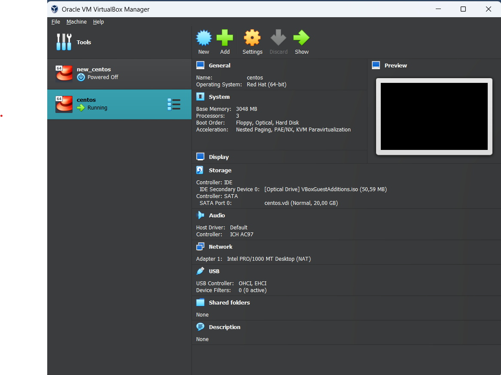
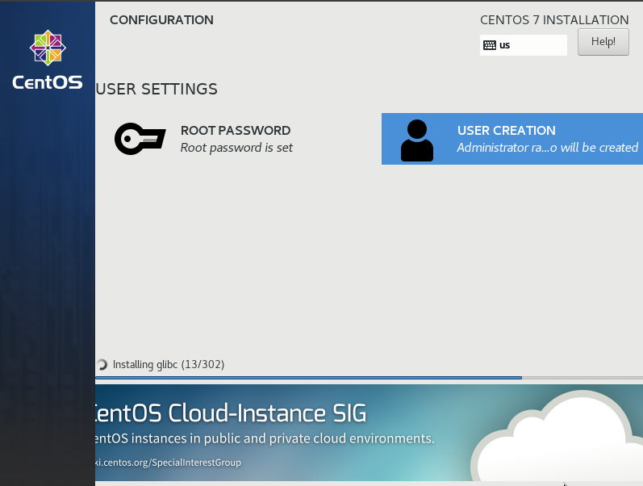
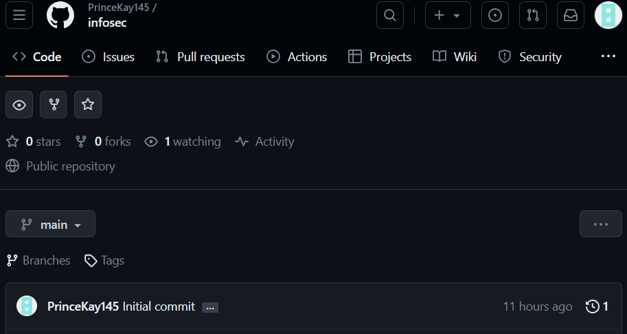
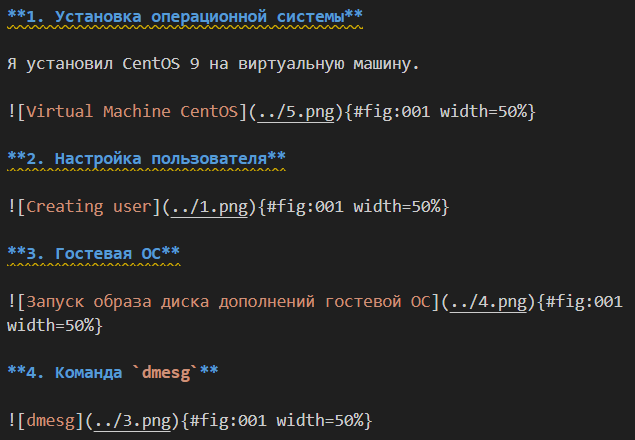

---
## Front matter
lang: ru-RU
title: Презентация по лабораторной работе № 1
subtitle: Информационная безопасность
author: Адебайо Р. А.
institute: Российский университет дружбы народов, Москва, Россия
date: 09.09.2023
## i18n babel
babel-lang: russian
babel-otherlangs: english

## Formatting pdf
toc: false
toc-title: Содержание
slide_level: 2
aspectratio: 169
section-titles: true
theme: metropolis
header-includes:
 - \metroset{progressbar=frametitle,sectionpage=progressbar,numbering=fraction}
 - '\makeatletter'
 - '\beamer@ignorenonframefalse'
 - '\makeatother'
---

# Информация

## Докладчик

:::::::::::::: {.columns align=center}
::: {.column width="70%"}

* Адебайо Ридвануллахи Айофе
* студент группы НКНбд-01-20
* Факультет физико-математических и естественных наук
* Российский университет дружбы народов
* [Страничка на GitHub](https://github.com/PrinceKay145)
* [Страничка на LinkedIn](https://www.linkedin.com/in/ridwan-adebayo-0443a2231/)

:::
::::::::::::::

## Цель лабораторной работы

* Целью данной работы является приобретение практических навыков установки операционной системы на виртуальную машину, настройки минимально необходимых для дальнейшей работы сервисов.

* Изучить идеологию и применение средств контроля версий.

* Освоить умения по работе с git.

* Научиться оформлять отчёты с помощью легковесного языка разметки Markdown.

## Выполнение лабораторной работы

* Linux дистрибутив CentOS 9

:::::::::::::: {.columns align=center}
::: {.column width="60%"}
{#fig:001 width=50%}
:::
::: {.column width="60%"}
{#fig:001 width=50%}
:::
::::::::::::::

## Выполнение лабораторной работы(1)

* Github

:::::::::::::: {.columns align=center}
::: {.column width="60%"}
{#fig:001 width=50%}
:::
::::::::::::::

## Выполнение лабораторной работы(2)

* Markdown

:::::::::::::: {.columns align=center}
::: {.column width="60%"}
 {#fig:001 width=50%}
:::
::::::::::::::

# Вывод

* Установил CentOS 9 на виртуальную машину
* Настроил инструменты для создания отчетов к лабораторной работе
* Написал отчёт по лабораторной работе в формате Markdown
