---
## Front matter
title: "Отчёта по лабораторной работе № 2"
subtitle: "Информационная безопасность"
author: "Адебайо Ридвануллахи Айофе"

## Generic otions
lang: ru-RU
toc-title: "Содержание"

## Bibliography
bibliography: bib/cite.bib
csl: pandoc/csl/gost-r-7-0-5-2008-numeric.csl

## Pdf output format
toc: true # Table of contents
toc-depth: 2
lof: true # List of figures
lot: true # List of tables
fontsize: 12pt
linestretch: 1.5
papersize: a4
documentclass: scrreprt
## I18n polyglossia
polyglossia-lang:
  name: russian
  options:
	- spelling=modern
	- babelshorthands=true
polyglossia-otherlangs:
  name: english
## I18n babel
babel-lang: russian
babel-otherlangs: english
## Fonts
mainfont: PT Serif
romanfont: PT Serif
sansfont: PT Sans
monofont: PT Mono
mainfontoptions: Ligatures=TeX
romanfontoptions: Ligatures=TeX
sansfontoptions: Ligatures=TeX,Scale=MatchLowercase
monofontoptions: Scale=MatchLowercase,Scale=0.9
## Biblatex
biblatex: true
biblio-style: "gost-numeric"
biblatexoptions:
  - parentracker=true
  - backend=biber
  - hyperref=auto
  - language=auto
  - autolang=other*
  - citestyle=gost-numeric
## Pandoc-crossref LaTeX customization
figureTitle: "Рис."
tableTitle: "Таблица"
listingTitle: "Листинг"
lofTitle: "Список иллюстраций"
lotTitle: "Список таблиц"
lolTitle: "Листинги"
## Misc options
indent: true
header-includes:
  - \usepackage{indentfirst}
  - \usepackage{float} # keep figures where there are in the text
  - \floatplacement{figure}{H} # keep figures where there are in the text
---

## Цель работы

Получение практических навыков работы в консоли с атрибутами файлов, закрепление теоретических основ дискреционного разграничения доступа в современных системах с открытым кодом на базе ОС Linux.

## Tеорическое введение

В операционной системе Linux есть много отличных функций безопасности, но одна из самых важных - это система прав доступа к файлам. Изначально каждый файл имел три параметра доступа. Вот они:

* Чтение - разрешает получать содержимое файла, но на запись нет. Для каталога позволяет получить список файлов и каталогов, расположенных в нем

* Запись - разрешает записывать новые данные в файл или изменять существующие, а также позволяет создавать и изменять файлы и каталоги

* Выполнение - невозможно выполнить программу, если у нее нет флага выполнения. Этот атрибут устанавливается для всех программ и скриптов, именно с помощью него система может понять, что этот файл нужно
запускать как программу

Команды, которые могут понадобиться при работе с правами доступа:

* “ls -l” - для просмотра прав доступа к файлам и каталогам

* “chmod категория действие флаг файл или каталог” - для изменения прав
доступа к файлам и каталогам (категорию действие и флаг можно заменить
на набор из трех цифр от 0 до 7)

Значения флагов прав:

* – - нет никаких прав
* –x - разрешено только выполнение файла, как программы, но не изменение и не чтение
* -w- - разрешена только запись и изменение файла
* -wx - разрешено изменение и выполнение, но в случае с каталогом, невозможно посмотреть его содержимое
* r– - права только на чтение
* r-x - только чтение и выполнение, без права на запись
* rw- - права на чтение и запись, но без выполнения
* rwx - все права

## Выполнение лабораторной работы

1. В установленной при выполнении предыдущей лабораторной работы операционной системе создайте учётную запись пользователя guest (использую учётную запись администратора)(см. рис. @fig:001): `useradd guest`

2. Задайте пароль для пользователя guest (использую учётную запись администратора)(см. рис. @fig:001): `passwd guest`

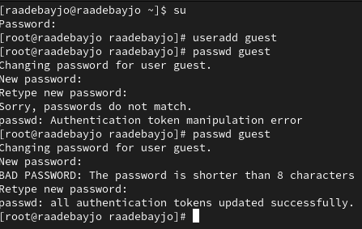{#fig:001 width=70%}

3. Войдите в систему от имени пользователя guest.

{#fig:002 width=70%}

4. Определите директорию, в которой вы находитесь, командой pwd. Сравните её с приглашением командной строки. Определите, является ли она вашей домашней директорией? Если нет, зайдите в домашнюю директорию.(см. рис. @fig:003)

5. Уточните имя вашего пользователя командой whoami.(см. рис. @fig:003)

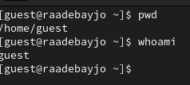{#fig:003 width=70%}

6. Уточните имя вашего пользователя, его группу, а также группы, куда входит пользователь, командой `id`. Выведенные значения `uid`, `gid` и др. запомните. Сравните вывод `id` с выводом команды `groups`.

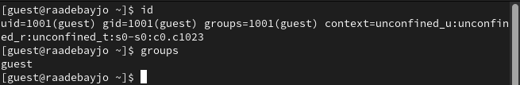{#fig:004 width=70%}

7. Сравните полученную информацию об имени пользователя с данными,
выводимыми в приглашении командной строки. **значения совпадают**

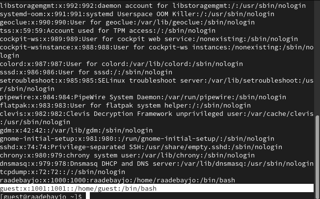{#fig:005 width=70%}

8. Просмотрите файл `/etc/passwd` командой `cat /etc/passwd`

`cat /etc/passwd | grep guest`

Найдите в нём свою учётную запись. Определите uid пользователя.Определите gid пользователя. Сравните найденные значения с полученными в предыдущих пунктах.

**uid - 1001**

**gid - 1001**

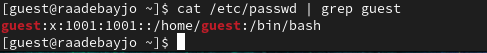{#fig:006 width=70%}

9. Определите существующие в системе директории командой `ls -l /home/` (см. рис. @fig:007)

Удалось ли вам получить список поддиректорий директории /home? - **Да** 

Какие права установлены на директориях? - **все права**

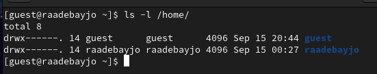{#fig:007 width=70%}

10. Проверьте, какие расширенные атрибуты установлены на поддиректориях, находящихся в директории /home, командой: `lsattr /home`

Удалось ли вам увидеть расширенные атрибуты директории? - **Да**

Удалось ли вам увидеть расширенные атрибуты директорий других
пользователей? - **Нет, отказ в доступ**

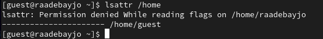{#fig:008 width=70%}

11. Создайте в домашней директории поддиректорию `dir1` командой `mkdir dir1` (см. рис. @fig:009)

Определите командами `ls -l` и `lsattr`, какие права доступа и расширенные атрибуты были выставлены на директорию `dir1`.

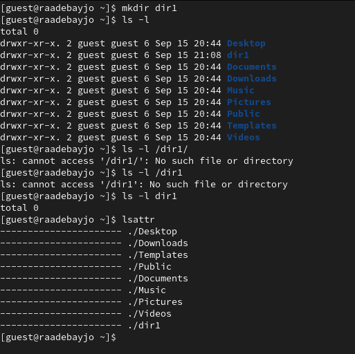{#fig:009 width=70%}

12. Снимите с директории `dir1` все атрибуты командой

`chmod 000 dir1`

и проверьте с её помощью правильность выполнения команды `ls -l` (см. рис. @fig:010)

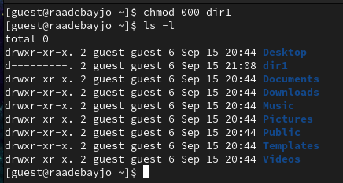{#fig:010 width=70%}

13. Попытайтесь создать в директории `dir1` файл `file1` командой
`echo "test" > /home/guest/dir1/file1`

Объясните, почему вы получили отказ в выполнении операции по созда-
нию файла? - **Невозможно создать файл, потому что нет прав**

Оцените, как сообщение об ошибке отразилось на создании файла? Проверьте командой

`ls -l /home/guest/dir1`

действительно ли файл file1 не находится внутри директории dir1. - **Нет**

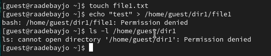{#fig:011 width=70%}

\begin{table} \caption{Установление права и разрешённых действий}
\begin{tabular}{|c|c|c|c|c|c|c|c|c|} \hline Права директории & 000 & 100 & 200 & 300 & 400 & 500 & 600 & 700 \\ \hline
Права файла & 000 & 100 & 200 & 300 & 400 & 500 & 600 & 700 \\ \hline
Создание файла & - & - & - & + & - & - & - & + \\ \hline
Удаление файла & - & - & - & + & - & - &  & + \\ \hline
Запись в файл & - & + & - & + & - & + & - & + \\ \hline
Чтение файла & - & + & - & + & - & + & - & + \\ \hline
Смена директории & - & - & - & + & - & + & - & + \\ \hline
Просмотр файлов в директории & - & - & - & - & + & + & + & + \\ \hline
Переименнование файла & - & - & - & + & - & - & - & + \\ \hline
Смена атрибутов файла & - & - & - & + & - & - & - & + \\ \hline
\end{tabular}
\end{table}

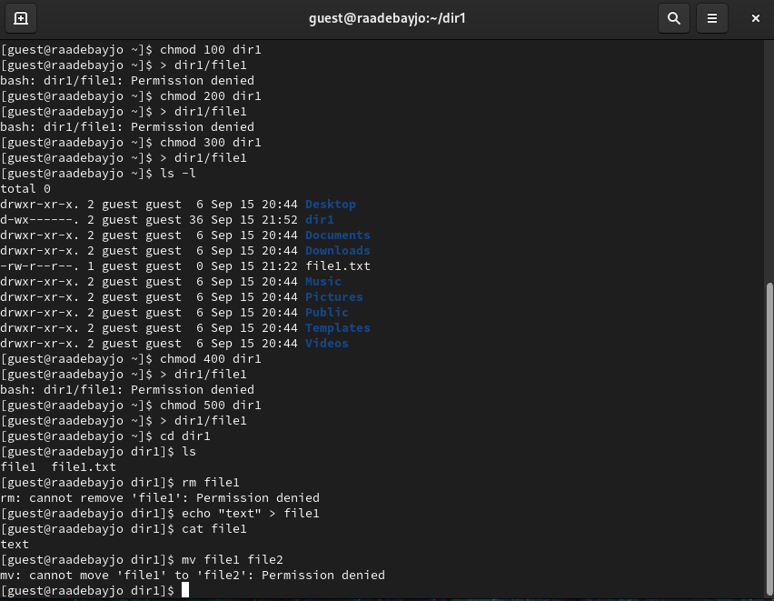{#fig:012 width=70%}

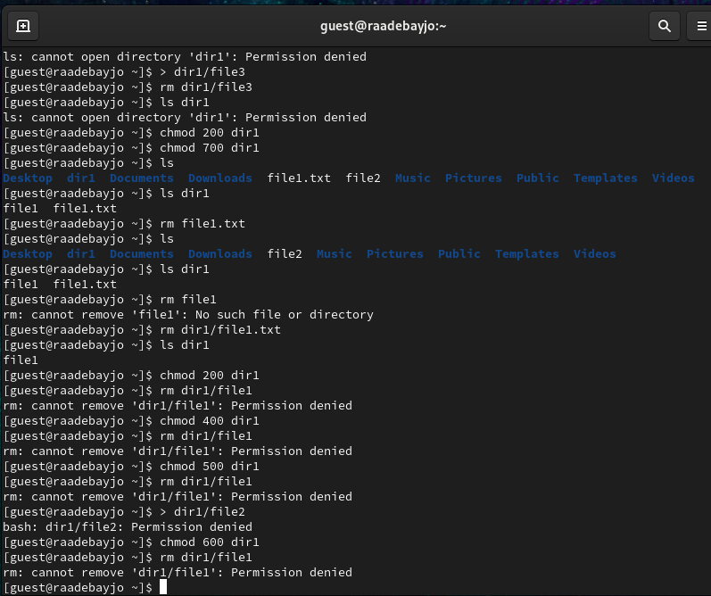{#fig:013 width=70%}

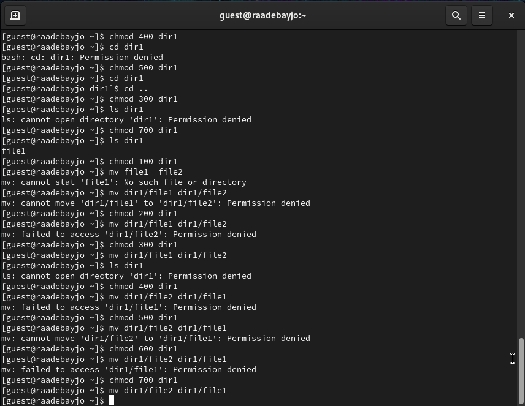{#fig:014 width=70%}

\begin{table} \caption{Минимально необходимые права для выполнения операций внутри директории}
\begin{tabular}{|c|c|c|} \hline Операция & **Минимальные права на директорию** & **Минимальные права на файл** \\ \hline

Создание файла & d -wx(300) & 000 \\ \hline
Удаление файла & d -wx(300) & 000 \\ \hline
Чтение файла & d -x(100) & 400 \\ \hline
Запись в файл & d -x(100) & 200 \\ \hline
Переименнование файла & d-wx(300) & 000 \\ \hline
Создание поддиректории & d -wx(300) & 000 \\ \hline
Удаление поддиректории & d -wx(300) & 000 \\ \hline

\end{tabular}
\end{table}

## Выводы

В ходе выполнения данной лабораторной работы я приобрела практические навыки работы в консоли с атрибутами файлов, закрепила теоретические основы дискреционного разграничения доступа в современных системах с открытым кодом на базе ОС Linux

## Список литературы

1. Кулябов Д. С.  *Лабораторная работа №2**: 002-lab_discret_attr.pdf*

2. Изменение атрибутов файлов в Linux [Электронный ресурс]. 2023.URL: <https://linux-notes.org/izmenenie-atributov-flagov-na-fajlah-v-unix-linux/> (дата обращения: 14.09.2023)