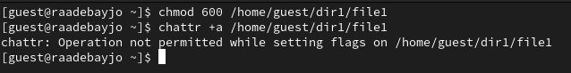
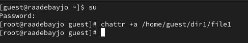
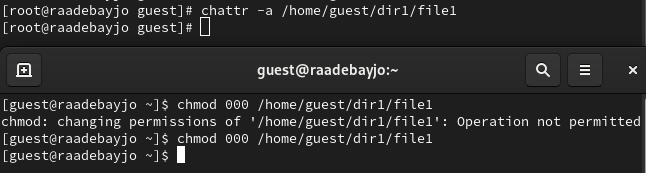
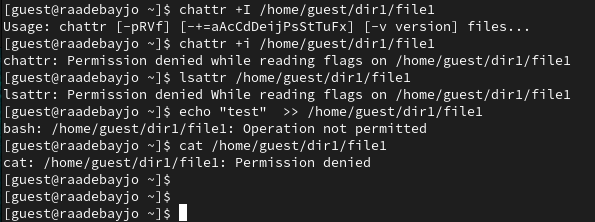

---
## Front matter
lang: ru-RU
title: Презентация по лабораторной работе № 4
subtitle: Информационная безопасность
author: Адебайо Р. А.
institute: Российский университет дружбы народов, Москва, Россия
date: 28.09.2023
## i18n babel
babel-lang: russian
babel-otherlangs: english

## Formatting pdf
toc: false
toc-title: Содержание
slide_level: 2
aspectratio: 169
section-titles: true
theme: metropolis
header-includes:
 - \metroset{progressbar=frametitle,sectionpage=progressbar,numbering=fraction}
 - '\makeatletter'
 - '\beamer@ignorenonframefalse'
 - '\makeatother'
---

# Информация

## Докладчик

:::::::::::::: {.columns align=center}
::: {.column width="70%"}

* Адебайо Ридвануллахи Айофе
* студент группы НКНбд-01-20
* Факультет физико-математических и естественных наук
* Российский университет дружбы народов
* [Страничка на GitHub](https://github.com/PrinceKay145)
* [Страничка на LinkedIn](https://www.linkedin.com/in/ridwan-adebayo-0443a2231/)

:::
::::::::::::::

# Цель лабораторной работы

* Получение практических навыков работы в консоли с расширенными атрибутами файлов
* Закрепление теоретических основ дискреционного разграничения доступа в современных системах с открытым кодом на базе ОС Linux.

## Выполнение лабораторной работы (1)

* установка прав на чтение и запись для файла

## Выполнение лабораторной работы (2)

* установка расширенных атрибутов

## Выполнение лабораторной работы (3)

## Выполнение лабораторной работы (4)

# Вывод

В ходе выполнения данной лабораторной работы я приобрела практические навыки работы в консоли с расширенными атрибутами и сравнил возможности работы с расширенными атрибутами с правами доступа.
