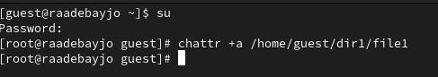
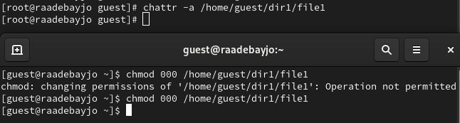
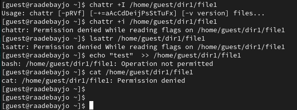

---
## Front matter
title: "Отчёта по лабораторной работе № 4"
subtitle: "Информационная безопасность"
author: "Адебайо Ридвануллахи Айофе"

## Generic otions
lang: ru-RU
toc-title: "Содержание"

## Bibliography
bibliography: bib/cite.bib
csl: pandoc/csl/gost-r-7-0-5-2008-numeric.csl

## Pdf output format
toc: true # Table of contents
toc-depth: 2
lof: true # List of figures
lot: true # List of tables
fontsize: 12pt
linestretch: 1.5
papersize: a4
documentclass: scrreprt
## I18n polyglossia
polyglossia-lang:
  name: russian
  options:
	- spelling=modern
	- babelshorthands=true
polyglossia-otherlangs:
  name: english
## I18n babel
babel-lang: russian
babel-otherlangs: english
## Fonts
mainfont: PT Serif
romanfont: PT Serif
sansfont: PT Sans
monofont: PT Mono
mainfontoptions: Ligatures=TeX
romanfontoptions: Ligatures=TeX
sansfontoptions: Ligatures=TeX,Scale=MatchLowercase
monofontoptions: Scale=MatchLowercase,Scale=0.9
## Biblatex
biblatex: true
biblio-style: "gost-numeric"
biblatexoptions:
  - parentracker=true
  - backend=biber
  - hyperref=auto
  - language=auto
  - autolang=other*
  - citestyle=gost-numeric
## Pandoc-crossref LaTeX customization
figureTitle: "Рис."
tableTitle: "Таблица"
listingTitle: "Листинг"
lofTitle: "Список иллюстраций"
lotTitle: "Список таблиц"
lolTitle: "Листинги"
## Misc options
indent: true
header-includes:
  - \usepackage{indentfirst}
  - \usepackage{float} # keep figures where there are in the text
  - \floatplacement{figure}{H} # keep figures where there are in the text
---

# Цель работы

Получение практических навыков работы в консоли с расширенными атрибутами файлов.

# Tеорическое введение

В операционной системе Linux есть много отличных функций безопасности, но одна из самых важных - это система прав доступа к файлам. Изначально каждый файл имел три параметра доступа. Вот они:

* Чтение - разрешает получать содержимое файла, но на запись нет. Для каталога позволяет получить список файлов и каталогов, расположенных в нем

* Запись - разрешает записывать новые данные в файл или изменять существующие, а также позволяет создавать и изменять файлы и каталоги

* Выполнение - невозможно выполнить программу, если у нее нет флага выполнения. Этот атрибут устанавливается для всех программ и скриптов, именно с помощью него система может понять, что этот файл нужно
запускать как программу

Команды, которые могут понадобиться при работе с правами доступа:

* “ls -l” - для просмотра прав доступа к файлам и каталогам

* “chmod категория действие флаг файл или каталог” - для изменения прав
доступа к файлам и каталогам (категорию действие и флаг можно заменить
на набор из трех цифр от 0 до 7)

Значения флагов прав:

* – - нет никаких прав
* –x - разрешено только выполнение файла, как программы, но не изменение и не чтение
* -w- - разрешена только запись и изменение файла
* -wx - разрешено изменение и выполнение, но в случае с каталогом, невозможно посмотреть его содержимое
* r– - права только на чтение
* r-x - только чтение и выполнение, без права на запись
* rw- - права на чтение и запись, но без выполнения
* rwx - все права

# Выполнение лабораторной работы

1. От имени пользователя guest определите расширенные атрибуты файла
`/home/guest/dir1/file1` командой
`lsattr /home/guest/dir1/file1`

{#fig:001 width=70%}

2. Установите командой
`chmod 600 file1`
на файл `file1` права, разрешающие чтение и запись для владельца файла.

3. Попробуйте установить на файл `/home/guest/dir1/file1` расширенный атрибут a от имени пользователя `guest`:
`chattr +a /home/guest/dir1/file1`

{#fig:002 width=70%}

4. Зайдите на третью консоль с правами администратора либо повысьте свои права с помощью команды su. Попробуйте установить расширенный атрибут a на файл `/home/guest/dir1/file1` от имени суперпользователя:
`chattr +a /home/guest/dir1/file1`

{#fig:003 width=70%}

5. От пользователя guest проверьте правильность установления атрибута:
`lsattr /home/guest/dir1/file1` (см. @fig:004)

6. Выполните дозапись в файл `file1` слова `«test»` командой
`echo "test" /home/guest/dir1/file1`
После этого выполните чтение файла `file1` командой
`cat /home/guest/dir1/file1`
Убедитесь, что слово test было успешно записано в `file1`.

{#fig:004 width=70%}

7. Попробуйте удалить файл `file1` либо стереть имеющуюся в нём информацию командой
`echo "abcd" > /home/guest/dirl/file1`
Попробуйте переименовать файл.

{#fig:005 width=70%}

8. Попробуйте с помощью команды
`chmod 000 file1`
установить на файл `file1` права, например, запрещающие чтение и запись для владельца файла. Удалось ли вам успешно выполнить указанные команды?

{#fig:006 width=70%}

9. Снимите расширенный атрибут a с файла /home/guest/dirl/file1 от имени суперпользователя командой
`chattr -a /home/guest/dir1/file1`
Повторите операции, которые вам ранее не удавалось выполнить.

{#fig:007 width=70%}

10. Повторите ваши действия по шагам, заменив атрибут «a» атрибутом «i».
Удалось ли вам дозаписать информацию в файл? - Нет, не удалось

{#fig:008 width=70%}

# Выводы

В результате выполнения работы вы повысили свои навыки использования интерфейса командой строки (CLI), познакомились на примерах с тем, как используются основные и расширенные атрибуты при разграничении доступа. Имели возможность связать теорию дискреционного разделения доступа (дискреционная политика безопасности) с её реализацией на практике в ОС Linux. Составили наглядные таблицы, поясняющие какие операции возможны при тех или иных установленных правах. Опробовали действие на практике расширенных атрибутов «а» и «i».

# Список литературы

1. Кулябов Д. С.  *Лабораторная работа №4**: 004-lab_discret_extattr.pdf*

2. Изменение атрибутов файлов в Linux [Электронный ресурс]. 2023.URL: <https://linux-notes.org/izmenenie-atributov-flagov-na-fajlah-v-unix-linux/> (дата обращения: 23.09.2023)
