---
## Front matter
title: "Отчёта по лабораторной работе № 5"
subtitle: "Информационная безопасность"
author: "Адебайо Ридвануллахи Айофе"

## Generic otions
lang: ru-RU
toc-title: "Содержание"

## Bibliography
bibliography: bib/cite.bib
csl: pandoc/csl/gost-r-7-0-5-2008-numeric.csl

## Pdf output format
toc: true # Table of contents
toc-depth: 2
lof: true # List of figures
lot: true # List of tables
fontsize: 12pt
linestretch: 1.5
papersize: a4
documentclass: scrreprt
## I18n polyglossia
polyglossia-lang:
  name: russian
  options:
	- spelling=modern
	- babelshorthands=true
polyglossia-otherlangs:
  name: english
## I18n babel
babel-lang: russian
babel-otherlangs: english
## Fonts
mainfont: PT Serif
romanfont: PT Serif
sansfont: PT Sans
monofont: PT Mono
mainfontoptions: Ligatures=TeX
romanfontoptions: Ligatures=TeX
sansfontoptions: Ligatures=TeX,Scale=MatchLowercase
monofontoptions: Scale=MatchLowercase,Scale=0.9
## Biblatex
biblatex: true
biblio-style: "gost-numeric"
biblatexoptions:
  - parentracker=true
  - backend=biber
  - hyperref=auto
  - language=auto
  - autolang=other*
  - citestyle=gost-numeric
## Pandoc-crossref LaTeX customization
figureTitle: "Рис."
tableTitle: "Таблица"
listingTitle: "Листинг"
lofTitle: "Список иллюстраций"
lotTitle: "Список таблиц"
lolTitle: "Листинги"
## Misc options
indent: true
header-includes:
  - \usepackage{indentfirst}
  - \usepackage{float} # keep figures where there are in the text
  - \floatplacement{figure}{H} # keep figures where there are in the text
---

# Цель работы

Изучение механизмов изменения идентификаторов, применения SetUID- и Sticky-битов. Получение практических навыков работы в консоли с дополнительными атрибутами. Рассмотрение работы механизма смены идентификатора процессов пользователей, а также влияние бита Sticky на запись и удаление файлов.

# Tеорическое введение

SetUID, SetGID и Sticky - это специальные типы разрешений позволяют задавать расширенные права доступа на файлы или каталоги.

* SetUID (set user ID upon execution — «установка ID пользователя во время выполнения) являются флагами прав доступа в Unix, которые разрешают пользователям запускать исполняемые файлы с правами владельца исполняемого файла.

* SetGID (set group ID upon execution — «установка ID группы во время выполнения») являются флагами прав доступа в Unix, которые разрешают пользователям запускать исполняемые файлы с правами группы исполняемого файла.

* Sticky bit в основном используется в общих каталогах, таких как /var или /tmp, поскольку пользователи могут создавать файлы, читать и выполнять их, принадлежащие другим пользователям, но не могут удалять файлы, принадлежащие другим пользователям.

# Выполнение лабораторной работы

## Создание программы

Для начала я убедился, что компилятор gcc установлен, используя команду `gcc --version` (см. @fig:001).

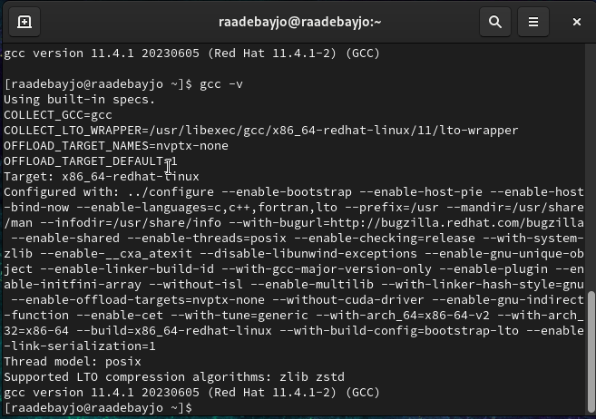{#fig:001 width=70%}

Затем отключил систему запретов до очередной перезагрзка системы командой `sudo setenforce 0`, после чего команда `getenforce` вывела `Permissive` (см. @fig:002).

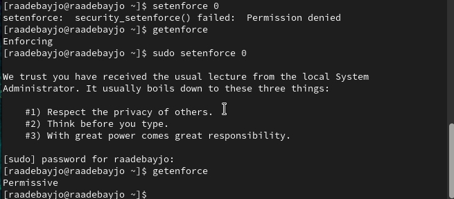{#fig:002 width=70%}

Проверил успешное выполнение команд `whereis gcc` и `whereis g++` (см. @fig:003)
{#fig:003 width=70%}

Вошел в систему от имени пользователя guest командой `su - guest`. Создал программу `simpleid.c` командой `touch simpleid.c` и открыл её в редакторе командой `vim /home/guest/simpleid.c`

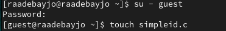

Код программы выглядит следующим образом

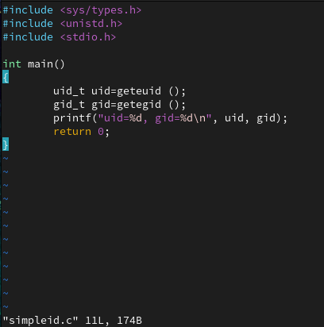

Скомпилировал программу и убедился, что файл программы был создан командой “gcc simpleid.c -o simpleid”. Выполнил программу simpleid командой “./simpleid”, а затем выполнил системную программу id командой “id”. Результаты, полученные в результате выполнения обеих команд, совпадают (uid=1001 и gid=1001)

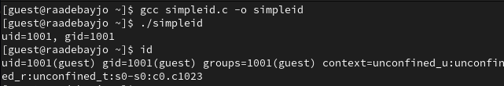

Усложнил программу, добавив вывод действительных идентификаторов

Скомпилировал и запустил simpleid2.c командами `gcc simpleid2.c -o simpleid2` и `./simpleid2`

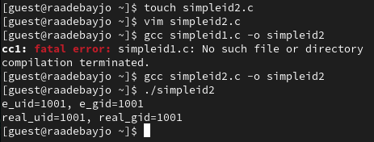

От имени суперпользователя выполнил команды `sudo chown root:guest /home/guest/simpleid2` и `sudo chmod u+s /home/guest/simpleid2`, затем выполнил проверку правильности установки новых атрибутов и смены владельца файла simpleid2 командой `sudo ls -l /home/guest/simpleid2`. Этими командами была произведена смена пользователя файла на root и установлен SetUID-бит.

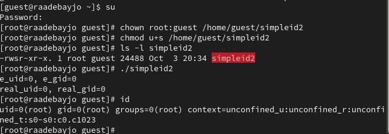

Запустил программы simpleid2 и id. Теперь появились различия в uid

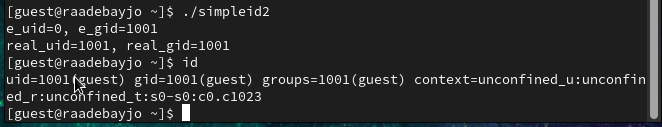

Создаем программу readfile.c

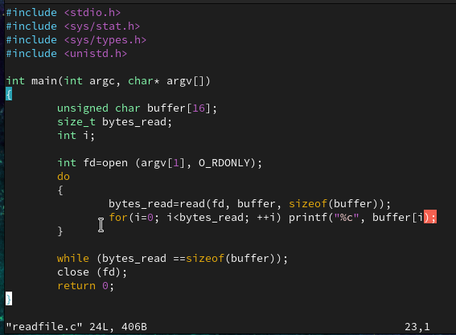

Скомпилировал созданную программу командой `gcc readfile.c -o readfile`. 

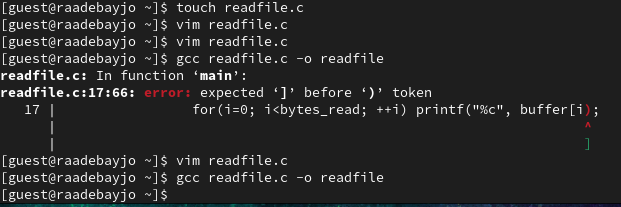

Сменил владельца у файла readfile.c командой `sudo chown root:guest /home/guest/readfile.c` и поменял права так, чтобы только суперпользователь мог прочитать его, а guest не мог, с помощью команды `sudo chmod 700 /home/guest/readfile.c`. Теперь убедился, что пользователь guest не может
прочитать файл readfile.c командой `cat readfile.c`, получив отказ в доступе

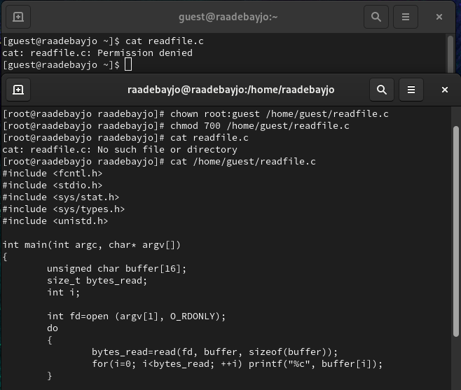

Поменял владельца у программы readfile и устанавила SetUID. Проверил, может ли программа readfile прочитать файл readfile.c командой `./readfile readfile.c`. **Прочитать удалось**. Аналогично проверил, можно ли прочитать файл `/etc/shadow`. **Прочитать удалось**

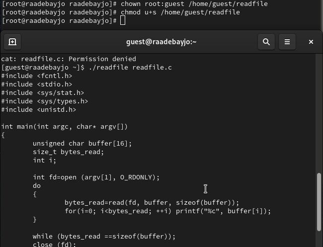

## Исследование Sticky-бита

Командой `ls -l / | grep tmp` убеждился, что атрибут Sticky на директории /tmp установлен. От имени пользователя guest создал файл file01.txt в директории /tmp со словом test командой `echo "test" > /tmp/file01.txt`. Просмотрел атрибуты у только что созданного файла и разрешаем чтение и запись для категории пользователей *все остальные* командами `ls -l /tmp/file01.txt` и `chmod o+rw /tmp/file01.txt`.

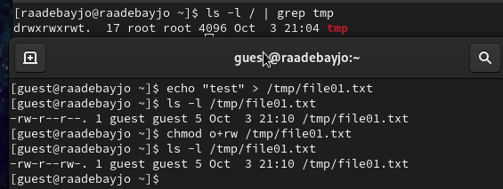

От имени пользователя guest2 попробовал прочитать файл командой `cat /tmp/file01.txt` - это удалось. Далее попытался дозаписать в файл слово test2, проверить содержимое файла и записать в файл слово test3, стерев при этом всю имеющуюся в файле информацию - эти операции удалось выполнить только в случае, если еще дополнительно разрешить чтение и запись для группы пользователей командой `chmod g+rw /tmp/file01.txt`. От имени пользователя guest2 попробовал удалить файл - это не удается ни в каком из случаев, возникает ошибка.

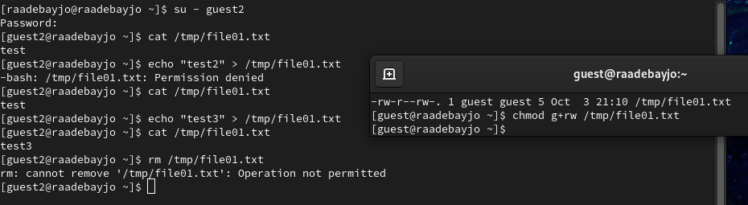

Повысила права до суперпользователя командой `su -` и выполнила команду, снимающую атрибут t с директории /tmp `chmod -t /tmp`. После чего покинула режим суперпользователя командой “exit”. Повторила предыдущие шаги. Теперь мне удалось удалить файл file01.txt от имени пользователя, не являющегося его владельцем

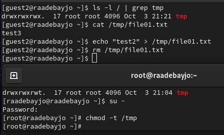

Повысила свои права до суперпользователя и вернула атрибут t на директорию /tmp

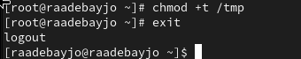

# Выводы

В ходе выполнения данной лабораторной работы я изучил механизмы изменения идентификаторов, применение SetUID- и Sticky-битов. Получил практические навыки работы в консоли с дополнительными атрибутами. Рассмотрел работу механизма смены идентификатора процессов пользователей, а также влияние бита Sticky на запись и удаление файлов.

# Список литературы

1. Кулябов Д. С.  *Лабораторная работа №5**: 005-lab_discret_sticky.pdf*

2. Использование SETUID, SETGID и Sticky bit для расширенной настройки прав доступа в операционных системах Linux [Электронный ресурс]. 2023.URL: <https://ruvds.com/ru/helpcenter/suid-sgid-sticky-bit-linux/> (дата обращения: 05.10.2023)
