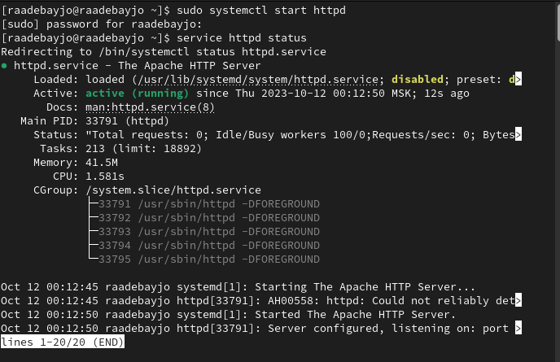
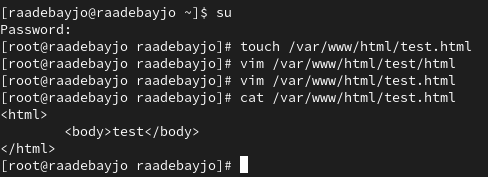
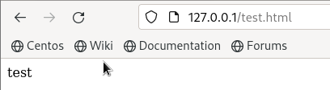

---
## Front matter
lang: ru-RU
title: Презентация по лабораторной работе № 6
subtitle: Информационная безопасность
author: Адебайо Р. А.
institute: Российский университет дружбы народов, Москва, Россия
date: 13.10.2023
## i18n babel
babel-lang: russian
babel-otherlangs: english

## Formatting pdf
toc: false
toc-title: Содержание
slide_level: 2
aspectratio: 169
section-titles: true
theme: metropolis
header-includes:
 - \metroset{progressbar=frametitle,sectionpage=progressbar,numbering=fraction}
 - '\makeatletter'
 - '\beamer@ignorenonframefalse'
 - '\makeatother'
---

# Информация

## Докладчик

:::::::::::::: {.columns align=center}
::: {.column width="70%"}

* Адебайо Ридвануллахи Айофе
* студент группы НКНбд-01-20
* Факультет физико-математических и естественных наук
* Российский университет дружбы народов
* [Страничка на GitHub](https://github.com/PrinceKay145)
* [Страничка на LinkedIn](https://www.linkedin.com/in/ridwan-adebayo-0443a2231/)

:::
::::::::::::::

# Цель лабораторной работы

Развить навыки администрирования ОС Linux. Получить первое практическое знакомство с технологией SELinux. Проверить работу SELinx на практике совместно с веб-сервером Apache.

## Выполнение лабораторной работы

Обратился с помощью браузера к веб-серверу, запущенному на моем компьютере, и убедился, что последний работает с помощью команды “service httpd status”

## Выполнение лабораторной работы(1)

От имени суперпользователя создал html-файл /var/www/html/test.html. Контекст созданного файла - httpd_sys_content_t

Обратился к файлу через веб-сервер, введя в браузере адрес “<http://127.0.0.1/test.html”>. Файл был успешно отображен

:::::::::::::: {.columns align=center}
::: {.column width="60%"}
{#fig:001 width=50%}
:::
::: {.column width="60%"}
{#fig:002 width=50%}
:::
::::::::::::::

## Выполнение лабораторной работы(2)

Попробовал еще раз получить доступ к файлу через веб-сервер, введя в браузере адрес “<http://127.0.0.1/test.html”>

:::::::::::::: {.columns align=center}
::: {.column width="60%"}
{#fig:001 width=50%}
:::
::: {.column width="60%"}
{#fig:002 width=50%}
:::
::::::::::::::

## Выполнение лабораторной работы(3)

Вернул контекст “httpd_sys_cоntent_t” файлу “/var/www/html/test.html” командой “chcon -t httpd_sys_content_t /var/www/html/test.html” (рис. 3.16) и после этого попробовал получить доступ к файлу через веб-сервер, введя адрес “<http://127.0.0.1:81/test.html”>, в результате чего увидел содежимое файла - слово “test”

# Вывод

В ходе выполнения данной лабораторной работы я развила навыки администрирования ОС Linux, получил первое практическое знакомство с технологией SELinux и проверил работу SELinux на практике совместно с веб-сервером Apache.