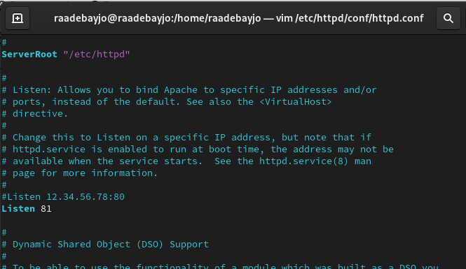

---
## Front matter
title: "Отчёта по лабораторной работе № 6"
subtitle: "Информационная безопасность"
author: "Адебайо Ридвануллахи Айофе"

## Generic otions
lang: ru-RU
toc-title: "Содержание"

## Bibliography
bibliography: bib/cite.bib
csl: pandoc/csl/gost-r-7-0-5-2008-numeric.csl

## Pdf output format
toc: true # Table of contents
toc-depth: 2
lof: true # List of figures
lot: true # List of tables
fontsize: 12pt
linestretch: 1.5
papersize: a4
documentclass: scrreprt
## I18n polyglossia
polyglossia-lang:
  name: russian
  options:
	- spelling=modern
	- babelshorthands=true
polyglossia-otherlangs:
  name: english
## I18n babel
babel-lang: russian
babel-otherlangs: english
## Fonts
mainfont: PT Serif
romanfont: PT Serif
sansfont: PT Sans
monofont: PT Mono
mainfontoptions: Ligatures=TeX
romanfontoptions: Ligatures=TeX
sansfontoptions: Ligatures=TeX,Scale=MatchLowercase
monofontoptions: Scale=MatchLowercase,Scale=0.9
## Biblatex
biblatex: true
biblio-style: "gost-numeric"
biblatexoptions:
  - parentracker=true
  - backend=biber
  - hyperref=auto
  - language=auto
  - autolang=other*
  - citestyle=gost-numeric
## Pandoc-crossref LaTeX customization
figureTitle: "Рис."
tableTitle: "Таблица"
listingTitle: "Листинг"
lofTitle: "Список иллюстраций"
lotTitle: "Список таблиц"
lolTitle: "Листинги"
## Misc options
indent: true
header-includes:
  - \usepackage{indentfirst}
  - \usepackage{float} # keep figures where there are in the text
  - \floatplacement{figure}{H} # keep figures where there are in the text
---

# Цель работы

Развить навыки администрирования ОС Linux. Получить первое практическое знакомство с технологией SELinux. Проверить работу SELinx на практике совместно с веб-сервером Apache.

# Tеорическое введение

SELinux (Security-Enhanced Linux) обеспечивает усиление защиты путем внесения изменений как на уровне ядра, так и на уровне пространства пользователя, что превращает ее в действительно «непробиваемую» операционную систему. Впервые эта система появилась в четвертой версии CentOS, а в 5 и 6 версии реализация была существенно дополнена и улучшена.

SELinux имеет три основных режим работы:

- Enforcing: Режим по-умолчанию. При выборе этого режима все действия, которые каким-то образом нарушают текущую политику безопасности, будут блокироваться, а попытка нарушения будет зафиксирована в журнале.

- Permissive: В случае использования этого режима, информация о всех действиях, которые нарушают текущую политику безопасности, будут зафиксированы в журнале, но сами действия не будут заблокированы.

- Disabled: Полное отключение системы принудительного контроля доступа.

Политика SELinux определяет доступ пользователей к ролям, доступ ролей к доменам и доступ доменов к типам.

Контекст безопасности — все атрибуты SELinux — роли, типы и домены.

Apache — это свободное программное обеспечение, с помощью которого можно создать веб-сервер. Данный продукт возник как доработанная версия другого HTTP-клиента от национального центра суперкомпьютерных приложений (NCSA).

Для чего нужен Apache сервер:

- чтобы открывать динамические PHP-страницы,
- для распределения поступающей на сервер нагрузки,
- для обеспечения отказоустойчивости сервера,
- чтобы потренироваться в настройке сервера и запуске PHP-скриптов.

Apache является кроссплатформенным ПО и поддерживает такие операционные системы, как Linux, BSD, MacOS, Microsoft, BeOS и другие.

# Выполнение лабораторной работы

Вошел в систему под своей учетной записью и убедился, что SELinux работает в режиме enforcing политики targeted с помощью команд “getenforce” и “sestatus”

Обратился с помощью браузера к веб-серверу, запущенному на моем компьютере, и убедился, что последний работает с помощью команды “service httpd status”

С помощью команды “ps auxZ | grep httpd” определил контекст безопасности веб-сервера Apache - httpd_t

Посмотрел текущее состояние переключателей SELinux для Apache с помощью команды “sestatus -bigrep httpd”, многие из переключателей находятся в положении “off”

Посмотрел статистику по политике с помощью команды “seinfo”. Множество пользователей - 8, ролей - 14, типов 4995

С помощью команды “ls -lZ /var/www” посмотрел файлы и поддиректории, находящиеся в директории /var/www. Используя команду “ls -lZ /var/www/html”, определил, что в данной директории файлов нет. Только владелец/суперпользователь может создавать файлы в директории /var/www/html

От имени суперпользователя создал html-файл /var/www/html/test.html. Контекст созданного файла - httpd_sys_content_t

Обратился к файлу через веб-сервер, введя в браузере адрес “<http://127.0.0.1/test.html”>. Файл был успешно отображен

Изучив справку man httpd_selinux, выяснила, что для httpd определены следующие контексты файлов: httpd_sys_content_t, httpd_sys_script_exec_t, httpd_sys_script_ro_t, httpd_sys_script_rw_t, httpd_sys_script_ra_t, httpd_unconfined_script_exec_t.Контекст моего файла - httpd_sys_content_t (в таком случае содержимое должно быть доступно для всех скриптов httpd и для самого демона). Изменил контекст файла на samba_share_t командой “sudo chcon -t samba_share_t /var/www/html/test.html” и проверил, что контекст поменялся

Попробовал еще раз получить доступ к файлу через веб-сервер, введя в браузере адрес “<http://127.0.0.1/test.html”> и получил сообщение об ошибке (т.к. к установленному ранее контексту процесс httpd не имеет доступа)

Командой “ls -l /var/www/html/test.html” убедился, что читать данный файл может любой пользователь. Просмотрел системный лог-файл веб-сервера Apache командой “sudo tail /var/log/messages”, отображающий ошибки

В файле /etc/httpd/conf/httpd.conf заменил строчку “Listen 80” на “Listen 81”, чтобы установить веб-сервер Apache на прослушивание TCP-порта 81

Перезапускаем веб-сервер Apache и анализирует лог-файлы командой “tail -nl /var/log/messages”

Просмотрел файлы “var/log/http/error_log”, “/var/log/http/access_log” и “/var/log/audit/audit.log” и выяснил, что запись появился в последнем файле

Выполнил команду “semanage port -a -t http_port_t -р tcp 81” и убедился, что порт TCP-81 установлен. Проверил список портов командой “semanage port -l | grep http_port_t”, убедился, что порт 81 есть в списке и запускаем веб-сервер Apache снова

Вернул контекст “httpd_sys_cоntent_t” файлу “/var/www/html/test.html” командой “chcon -t httpd_sys_content_t /var/www/html/test.html” (рис. 3.16) и после этого попробовал получить доступ к файлу через веб-сервер, введя адрес “<http://127.0.0.1:81/test.html”>, в результате чего увидел содежимое файла - слово “test”

Исправил обратно конфигурационный файл apache, вернув “Listen 80”. Попытался удалить привязку http_port к 81 порту командой “semanage port -d -t http_port_t -p tcp 81”, но этот порт определен на уровне политики, поэтому его
нельзя удалить. Удалил файл “/var/www/html/test.html” командой “rm /var/www/html/test.html”

# Выводы

В ходе выполнения данной лабораторной работы я развил навыки администрирования ОС Linux, получил первое практическое знакомство с технологией SELinux и проверил работу SELinux на практике совместно с веб-сервером Apache.

# Список литературы

1. Кулябов Д. С.  *Лабораторная работа №5**: 006-lab_selinux.pdf*

2. Использование SETUID, SETGID и Sticky bit для расширенной настройки прав доступа в операционных системах Linux [Электронный ресурс]. 2023.URL: <https://ruvds.com/ru/helpcenter/suid-sgid-sticky-bit-linux/> (дата обращения: 05.10.2023)
